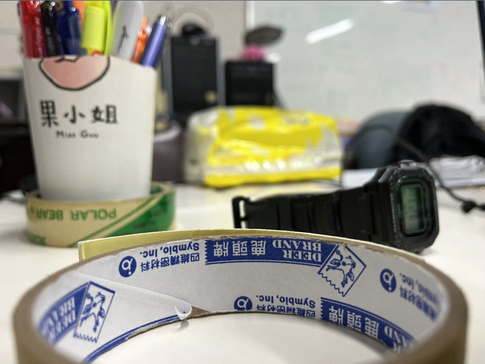
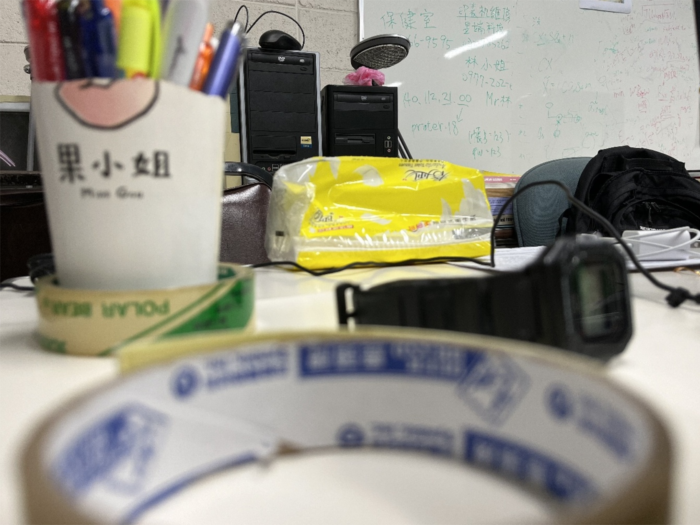
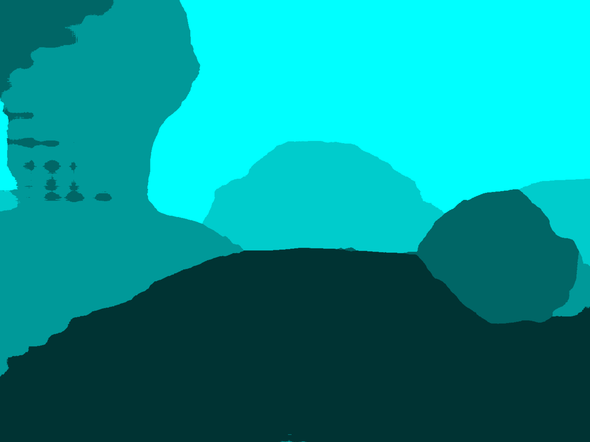

# 環境需求

Requirements:

numpy 
cv2 
os 
PIL.Image 
matplotlib.pyplot 
 

# 使用方式

## 運行前

把圖片放在 ./images/image_toss_here/ 
由近至遠命名，如下所示。 
（若無法由近至遠，至少最近的要為順位第一）  

焦距&emsp;圖片名稱 
近&emsp;&emsp;1.jpg  
｜&emsp;&emsp;2.jpg 
｜&emsp;&emsp;3.jpg 
｜&emsp;&emsp;4.jpg 
遠&emsp;&emsp;5.jpg 

依此類推

有附測試用的圖片，可以將其清空以不妨礙運行  

## 運行時

運行程式後會請使用者選擇123三種功能，由於前兩步驟會耗費不少時間，故可視使用者需求選擇要從哪個階段開始跑
 
1. 將 raw images 以焦距最近(1.jpg)的圖片為基準，進行縮放適配，用意是使兩者err不過大，在切換顯示時不會出現明顯斷層，並重新命名存進 ./images/adjust/，會在前綴補上 'adjust_'。  
2. 從 ./images/adjust/ 讀取已經適配處理好的圖片，開始使用Laplacian和Local summation的方式統計各圖各點的 Laplacian 值總和，並將該結果存進 ./npy/。  
3. 讀取先前運算的結果 ./npy/total.npy 來做使用。   

若手邊只有剛拍好熱騰騰的圖片，則建議選取1從頭運行。

若手邊有已經適配好，圖中物件大小落差不過大的圖片，則可以將其放入 ./images/adjust/ 並選擇2運行。

若先前已經跑過整支程式，想再看看結果，選擇3會跳過運算節省很多時間，但 ./images/adjust/ 中必須有相應的圖片。

## 運行完成

運行完成後console會顯示 
    
    Done! Please check the pop-up windows.
此時會有兩個彈出視窗：
1. 操作介面，即為圖片本身
2. 焦距對應的著色圖

上圖為操作介面。 
程式一開始預設會顯示焦距最近的圖片，如左圖所示，焦距在膠帶附近。 
而在視窗中點擊接近白板的部分，焦距則會滑行移動至後方，如右圖所示。  

上圖為焦距著色圖。 
會根據不同焦距來對其進行著色，可視化以方便觀察。
若命名方式有嚴格由近至遠，則越亮的地方表示點擊該區域會對焦到更遠的地方。

## 退出程式

在圖片視窗中按任意英文鍵或關閉所有圖片視窗皆可退出。

